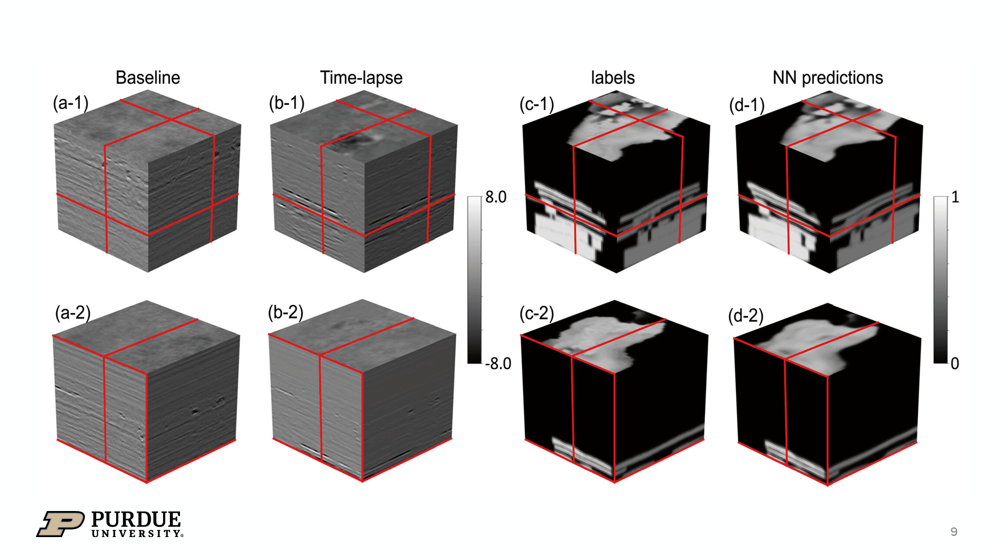

# CO2-NN-Sleipner

**Neural Network-Based CO₂ Interpretation From 4D Sleipner Seismic Images**

This project applies a 3D U-Net architecture for automated CO₂ plume detection using 4D seismic data from the Sleipner CCS site. It reproduces and extends the work of Li & Li (2021), demonstrating robust CO₂ interpretation over time-lapse seismic volumes.

---

## Overview

The goal is to predict the spatial distribution of injected CO₂ using baseline and time-lapse seismic images. This approach reduces the need for manual interpretation and ensures consistency across multiple acquisition vintages.

### Key Features

- 3D U-Net model for volumetric segmentation
- Robust to baseline/timelapse processing mismatch
- Trained using Sleipner 2010 CO₂ plume labels
- Evaluated across 1999–2010 seismic vintages
- Includes 2D and sparse-label training options

---

## Project Structure

CO2-NN-Sleipner/
│
├── 2D/ # 2D U-Net training and testing code
├── 3DD/ # 3D U-Net training and testing code
├── EXTRA_FILES/ # Helper scripts, e.g., labeling, plotting
├── figures/ # Result plots and visualizations
├── input_output_preparation.ipynb
├── Test_training.ipynb
├── Figure_plot_2D.ipynb
├── polygon_inclusion.py
├── Unet_parts.py
├── mynetwork.py
├── CO2_identify.py
├── labeling.py
└── README.md # You're here!

## Results

The trained model achieves consistent CO₂ plume segmentation across multiple years. Below are example predictions versus labels on 2010 data:

| Baseline vs Timelapse | Human-Labeled CO₂ Mask(Panel C) | NN Predicted CO₂ Mask(Panel D) |
|-----------------------|------------------------|------------------------|
| 94p10 vs 10p10        |  |  |

> The prediction closely matches the labeled plume boundaries in the top sand wedge layer, showing high spatial resolution and continuity.

## Citation:
Li, B., & Li, Y. E. (2021). Neural network-based CO₂ interpretation from 4D Sleipner seismic images. Journal of Geophysical Research: Solid Earth, 126(12), e2021JB022524. https://doi.org/10.1029/2021JB022524

## Acknowledgments:
Equinor and CO₂ DataShare for public seismic datasets

Prof. Elita Li (Purdue) for research guidance

Jupyter + PyTorch for open-source tools

## Contact:
Feel free to reach out:
GitHub: @drshtakp
Email: pated2126@gmail.com

---

## Getting Started

### Requirements

- Python 3.8+
- PyTorch 1.7+
- NumPy, Matplotlib
- Git LFS (if using `.dat` masks)

### Setup

```bash
git clone https://github.com/drshtakp/CO2-NN-Sleipner.git
cd CO2-NN-Sleipner
pip install -r requirements.txt  # optional
